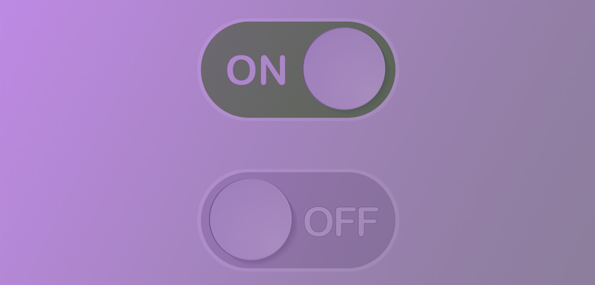

<br />
<p align="center">
  
  <h1 align="center">Feature Toggle - Remote Config</h1>
</p>

## What is inside?

This project uses stuff as:

- [ReactJS](https://reactjs.org/)
- [Redux](https://redux.js.org/)
- [Remote Config](https://styled-components.com/)

## About

This project was developed to demonstrate a way to create a toggle feature using Firebase Remote Config, it was developed using Redux and React.

## Getting Started

First, install dependencies:

```bash
npm install
# or
yarn install
```

Second, add firebase environment variables:

```bash
REACT_APP_API_KEY = ''
REACT_APP_AUTH_DOMAIN = ''
REACT_APP_PROJECT_ID = ''
REACT_APP_STORAGE_BUCKET = ''
REACT_APP_MESSAGING_SENDER_ID = ''
REACT_APP_APP_ID = ''
REACT_APP_MEASUREMENT_ID = ''

```

Third, run the development server:

```bash
npm run start
# or
yarn start
```
